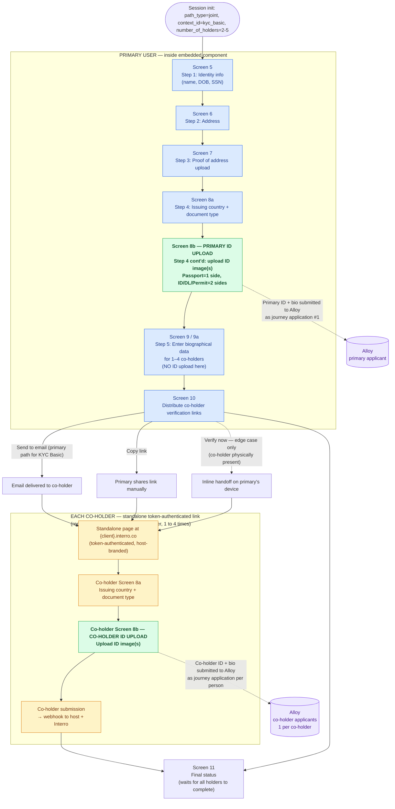

# Joint Account Flow — KYC Basic — ID Upload Sequencing

**Audience:** Alloy journey configuration team
**Purpose:** Show where and when identity documents are collected for the **primary user** and each **additional co-holder** in a KYC Basic joint account session, so the Alloy journey can be configured to accept ID uploads at the correct step per person.

---

## Key points for Alloy journey configuration

1. The session is **KYC Basic** — document capture happens in the embeddable UI, **not** via the Alloy SDK. Alloy's role here is screening/evaluation on the submitted document + biographical data, not live capture.
2. **Primary user** uploads their ID **inside the embedded component** (Step 4, before co-holder entry).
3. **Each additional co-holder** uploads their ID **outside** the primary user's embedded session, via a **standalone token-authenticated link** served at `{client}.interro.co`. The standalone page opens the same document upload flow (country/type → upload).
4. Per-person ID uploads arrive at Alloy asynchronously and at different times:
   - Primary user's ID → submitted when the primary reaches the end of Step 4.
   - Co-holder IDs → submitted independently, whenever each co-holder opens their link and completes the upload. May be minutes, hours, or days apart.
5. Alloy should treat **each holder as an independent applicant** (journey application per person), keyed by person index within the session. Aggregate "N of M verified" status is rolled up by Interro, not Alloy.

---

## Flow diagram

---

## When each person's ID reaches Alloy

| Person | Screen | Where it runs | When it submits | Alloy journey application |
|---|---|---|---|---|
| Primary user | 8a → 8b | Embedded component in host app | End of primary's Step 4 (before co-holder entry) | App #1, created at primary Step 4 submit |
| Co-holder 1 | 8a → 8b (standalone) | `{client}.interro.co` standalone page | When co-holder opens their link and finishes upload | App #2, created when co-holder submits |
| Co-holder 2..N | 8a → 8b (standalone) | `{client}.interro.co` standalone page | Independently, per co-holder | One app per co-holder |

---

## Configuration implications for the Alloy journey

- **One journey, multiple applications per session.** Each holder is a separate journey application tagged with a person index (primary vs co-holder 1..4) and the shared session ID.
- **Document-only entry points.** The Alloy SDK's live capture is **not** used in KYC Basic. The journey must accept pre-captured document images + biographical data and run screening/evaluation on them.
- **Asynchronous arrival.** Co-holder applications can be created hours or days after the primary user's. The journey must not require that all holders be submitted in the same transaction.
- **Per-person outcomes.** Each holder receives an independent approved / denied / review outcome. Interro rolls these up and only transitions the session to "submitted successfully" on Screen 11 after all holders terminate.
- **Returned-for-corrections.** If a specific holder is returned, only that holder's document/bio step re-opens — either in the primary's embedded session (primary) or via a fresh standalone link (co-holder). The journey application for that holder is updated in place.

---

## Out of scope for this diagram

- KYC Complete flow (uses Alloy SDK for live selfie/liveness per holder — documented separately).
- Proof-of-address upload for co-holders (co-holders do **not** upload supplementary documents; only the primary user does).
- Entity / Corporate flow.
